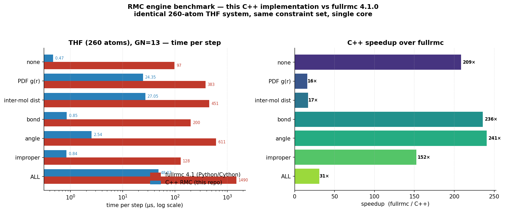

# Benchmarks

Two kinds of performance data live here:

1. **Internal micro-benchmarks** — Catch2 benchmarks of the engine's hot paths
   (incremental vs. full constraint recompute, TBB scaling, N-scaling). Driven
   by [`tools/bench_plot.py`](tools/bench_plot.py), rendered to `bench.png` /
   `tbb.png`.
2. **fullrmc head-to-head** — this C++ engine vs. the reference
   [fullrmc](https://github.com/bachiraoun/fullrmc) package (Python + Cython)
   on an identical problem. Driven by
   [`tools/frmc_thf_bench.py`](tools/frmc_thf_bench.py) +
   [`tools/frmc_compare.py`](tools/frmc_compare.py), rendered to
   `fullrmc_comparison.png`.

This document covers (2).

---

## fullrmc head-to-head



### What was compared

The same **260-atom THF system** (20 tetrahydrofuran molecules, 13 atoms each)
used by fullrmc's own bundled benchmark (`fullrmc/Examples/benchmark/run.py`).
The input data — `examples/benchmark/data/system.pdb` and `experimental.gr` —
is the exact data both engines consume.

Both engines run the identical RMC loop:

| | |
|---|---|
| **System** | 260 atoms, 20 THF molecules, no periodic boundary |
| **Moves** | random translation, amplitude 0–0.15 Å |
| **Group** | 13 atoms (one molecule moved per step), `GN=13` |
| **Constraints** | PDF g(r), inter-molecular distance, bond, angle, improper |
| **Cores** | 1 (single-threaded for both) |
| **Metric** | wall-clock **time per step** |

fullrmc constraint definitions mirror its shipped `run.py` (name-based bond /
angle / improper definitions). The C++ side is the committed
`examples/benchmark` workload, exercised through the `RMC_tests` THF
benchmarks (`tests/bench_thf.cpp`).

### Results (group size 13, time per step)

| Constraint | fullrmc 4.1 (µs/step) | C++ RMC (µs/step) | Speed-up |
|---|--:|--:|--:|
| none (move only)        |   97.0 |  0.47 | **209×** |
| PDF g(r)                |  383.1 | 24.35 |  **16×** |
| inter-molecular distance|  450.9 | 27.05 |  **17×** |
| bond                    |  200.3 |  0.85 | **236×** |
| angle                   |  611.4 |  2.54 | **241×** |
| improper                |  128.1 |  0.84 | **152×** |
| **all constraints**     | **1490.0** | **48.07** | **31×** |

The C++ all-constraints figure (48 µs/step ≈ 21 000 steps/s) is stable across
5 k–50 k-step runs; fullrmc holds ~1.49 ms/step (≈ 670 steps/s).

### How to read it

- **All-constraints is the realistic case: ~31× faster.** This is the number
  that matters for production refinement.
- The **PDF** and **inter-molecular-distance** constraints dominate runtime in
  *both* engines and show the *smallest* speed-ups (16–17×) — that's where
  fullrmc's Cython kernels are genuinely competitive, and where the C++
  all-constraints time is anchored.
- The cheap geometric constraints (bond / angle / improper) and the bare move
  loop show 150–240× — fullrmc's per-step Python orchestration overhead dwarfs
  the actual arithmetic there; the C++ engine does each in well under a
  microsecond.

### Fairness caveats

- **Single core both sides.** Neither engine's multicore path was exercised;
  the numbers above are the single-core comparison.
- Per-molecule angle definitions differ trivially (22 vs. 25 angles) —
  immaterial, since PDF/vdw dominate.
- fullrmc coordinates were not reset between sub-runs (4.1 disallows resetting
  the pdb on a normal frame); this affects acceptance counts, not time/step.

### Reproducing

fullrmc 4.1 does not install cleanly on Python 3.10 / numpy ≥ 1.24 out of the
box. Two shims are needed (both applied automatically by the script for the
numpy part; the `parser` stub is a one-liner):

```bash
python3 -m venv /tmp/frmc_env && source /tmp/frmc_env/bin/activate
pip install "cython<3" "numpy==1.26.4"
pip install --no-build-isolation fullrmc            # builds the Cython ext

# pdbparser does `import parser` (a Py2 stdlib module removed in 3.10):
SP=$(python3 -c "import site;print(site.getsitepackages()[0])")
echo '# stub for removed Py2 parser module' > "$SP/parser.py"
# (np.float / np.int aliases are restored inside frmc_thf_bench.py)
```

Then, from a directory holding `system.pdb` + `experimental.gr` (copy them from
`examples/benchmark/data/`):

```bash
# fullrmc: subsets at 2000 steps, all-constraints scaling at 1k/2k/5k
python3 tools/frmc_thf_bench.py 2000 "1000,2000,5000"   # -> frmc_results.json

# C++: the matching THF benchmarks (Release build)
./cmake-build-release/RMC_tests "bench: THF constraint subsets*" \
    --reporter XML --benchmark-samples 20 > cpp_subsets.xml
./cmake-build-release/RMC_tests "bench: THF step-count scaling*" \
    --reporter XML --benchmark-samples 10 > cpp_steps.xml

# combine -> table + fullrmc_comparison.png
python3 tools/frmc_compare.py
```

_Measured on a 16-core Linux box, single-threaded, `Release` build
(`-O3 -DNDEBUG`, LTO + `-march=native`), fullrmc 4.1.0._
