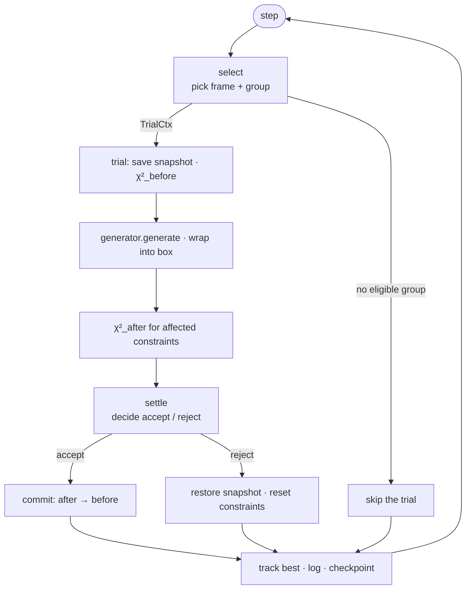
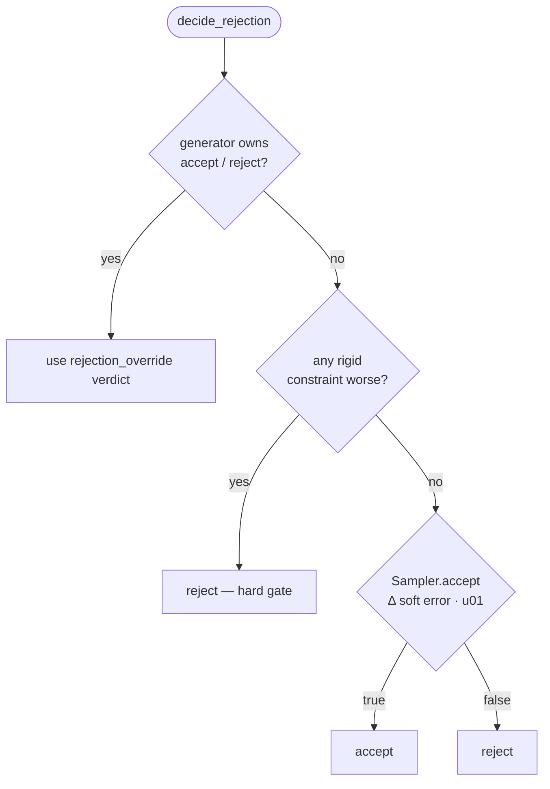
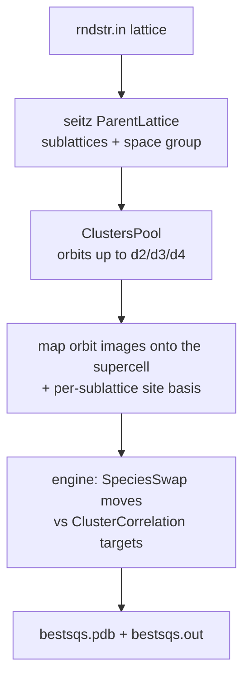

# Design

This document describes how RMC is put together: the data that flows through a
refinement, the engine's step pipeline, and the four extension contracts
(constraints, generators, samplers, selectors). It deliberately stops at the
*contracts* — the public, stable surface each component must honour. Each
`Constraint`, `MoveGenerator`, `Sampler` and `GroupSelector` is a value-semantic
handle: the first two are `boost::type_erasure::any` over the contract methods
(open sets — any type satisfying the concept), the last two are `std::variant`s
of the built-ins (closed sets).

For build instructions and the user-facing API, see [README.md](README.md).

## What RMC does

Reverse Monte Carlo refines an atomic configuration so that quantities computed
*from* it (a pair distribution g(r), a structure factor S(Q), an angular
distribution, cluster correlations, …) match experimental or target values. It
does this by repeatedly proposing a small random change to the structure,
scoring how the total error χ² changed, and accepting or rejecting the change
under a stochastic rule. Over many steps the configuration relaxes toward one
consistent with the data.

The same machinery drives `mcsqs_rmc`: an SQS search is just RMC where the moves
are species swaps and the target is the set of disordered cluster correlations.

## The objects

```
AtomicStructure   coordinates (N×3) + elements / names / residues / molecule_ids
BoundaryConditions  one value type: a periodic cell over a seitz::Lattice, or
                    open space with a volume — PeriodicBC(box) / InfiniteBC(volume)
Group             a set of atom indices + the MoveGenerator that perturbs them
Constraint        scores one term of χ²; caches before/after error
Sampler           the accept/reject rule given (χ²_before, χ²_after)
GroupSelector     picks which group moves next; learns from accept/reject
Engine            owns all of the above and runs the step loop
```

A **Group** is the unit of a move: an explicit list of atom indices plus the
generator that displaces them. One-atom groups give classic atomic RMC; a
molecule's atoms in one group with a `RotationGenerator` give rigid-body moves.

A **Constraint** owns one additive term of the total error. It caches the error
*before* and *after* a proposed move so the engine can form Δχ² without a full
recompute, and exposes whether it is *rigid* (a hard geometric gate that never
contributes to χ²) or *soft* (contributes to χ² and is judged by the Sampler).

## The engine pipeline

`Engine` derives from `EngineBase<Engine>` (CRTP). The base owns the step loop,
the three-tier acceptance logic, and orthogonal feature policies; `Engine`
supplies the per-engine specifics (frame storage and selection) through CRTP
customization points. Knowing the pipeline is enough to reason about every
component's contract — each contract method is called at a known stage.

One `step()` selects a frame and a group and, when one is eligible, runs a
trial; best-state tracking, logging and checkpointing follow every step:

```
select()  → pick a frame + group            → TrialCtx (or skip the trial)
trial()   → save snapshot; χ²_before for every constraint;
            group.generator.generate(...); wrap into the box;
            χ²_after for the affected constraints
settle()  → decide accept/reject; commit or roll back
```

If `select()` finds no eligible group, the step skips the trial.



### Three-tier acceptance

`settle()` calls `decide_rejection()`, which resolves the move in priority
order (`EngineBase::decide_rejection`):

1. **Generator override.** A gradient generator (HMC leapfrog, MALA Langevin)
   that implements its own accept/reject returns a verdict via
   `rejection_override()`; the engine defers to it entirely.
2. **Rigid hard gate.** Otherwise, if *any* rigid constraint got worse, the move
   is rejected outright. Rigid constraints contribute 0 to χ², so they act
   purely as geometric gates (e.g. a minimum-separation bond bound).
3. **Sampler soft gate.** Otherwise the `Sampler` decides from the change in the
   **total soft error** (sum over non-rigid constraints), using one uniform draw
   from the engine's dedicated acceptance RNG.



On accept, every constraint's cached `after` error becomes its new `before`; on
reject, the structure snapshot is restored and constraints reset. This is why
the constraint contract has explicit `accept`/`reject` calls — they commit or
discard the cached state, they don't recompute.

### Feature policies

`EngineBase` composes orthogonal, compile-time features as empty-base policies
(`[[no_unique_address]]`, so they cost nothing when off):

| Policy | Responsibility |
|---|---|
| `WithSpecies` | save/restore element labels around species-mutating moves |
| `WithFeedback` | forward accept/reject to an adaptive selector |
| `WithCollector` | stage/commit atom removals (`RemoveGenerator`) |
| `WithBestTracking` | keep the lowest-χ² configuration seen |
| `WithCheckpoint` | periodically serialise state to disk |

A policy hooks into a specific pipeline point (e.g. species save before the
move in `trial`, feedback at the end of `settle`). Adding a feature
means adding a policy and its hook, not editing the hot loop.

### Multi-frame

`Engine` can hold several structural frames against one dataset. Each step picks
one frame and one group; pair/angle constraints average their computed profile
across frames, so χ² is the error of the *averaged* curve — this damps
over-fitting to a single configuration. Single-frame refinement is just the
N = 1 case; the averaging lives in the constraints, not the loop. Per-step
histogram updates are incremental (O(K·N) for a K-atom group) rather than a full
O(N²) rebuild. Full rebuilds (initialisation, periodic resync) run through
`parallel::parallel_sum` (`core/Parallel.hpp`): round-robin lanes, each with its
own accumulator, summed at the end — a single lane when TBB is off.

## The four contracts

Constraints and move generators are **open** extension points: each is a
concept (`CConstraint`, `CMoveGenerator`), and any type satisfying it converts
to the matching handle — a `boost::type_erasure::any` with one
`BOOST_TYPE_ERASURE_MEMBER` per contract method. Samplers and selectors are
**closed**: `Sampler` and `GroupSelector` are `std::variant`s of the built-ins,
dispatched with `std::visit`, so adding one means adding an alternative to the
variant.

### Constraint — `constraints/Constraint.hpp`

A constraint owns one additive term of χ² and caches its before/after error.

| Method | Contract |
|---|---|
| `compute_before_move(coords, moved)` | Compute & cache the error for the current coords. `moved` = indices about to move; a constraint may recompute only affected terms. |
| `compute_after_move(coords, moved)` | Same, for the post-move coords → cached `after`. |
| `accept()` / `reject()` | Commit (`after`→`before`) or discard the cached after-state. `noexcept`. |
| `standard_error()` / `standard_error_before()` | Cached after / before error. **Rigid constraints return 0** for both — they never enter χ². |
| `should_reject()` | Per-constraint downhill test. Used only for the rigid hard gate. |
| `is_rigid()` | If true, any worsening is an immediate hard rejection and the term is excluded from χ². |
| `is_singular()` | If true, at most one instance of this type may be added. |
| `computation_cost()` | Relative cost hint (O(1), O(N), O(N²)); cheaper constraints are evaluated first so an early rigid rejection can skip expensive ones. |
| `name()` | Human label. |
| `set_boundary_conditions(bc)` / `set_collector(col)` | Engine wiring, called at registration. |
| `set_n_frames(n)` / `set_active_frame(k)` | Multi-frame support; no-ops for single-frame constraints. |
| `initialise()` | One-time setup (build target tables, prime histograms), called from `Engine::initialise()`. |

**Don't implement this by hand.** Derive from a base and implement a single
`compute_error(coords, moved) → double`:

- `ConstraintBase<Derived>` — a soft constraint. The base caches before/after,
  implements accept/reject/should_reject, and provides minimum-image helpers
  (`distance`, `distance_sq`) and `absent(i)` (true when atom `i` is staged for
  removal — skip its terms).
- `RigidConstraintBase<Derived>` — a hard gate. Same, but `standard_error*()`
  return 0 and `is_rigid()` is true.
- `SingularConstraintBase<Derived>` — soft, but limited to one instance.

### MoveGenerator — `generators/MoveGenerator.hpp`

A generator perturbs the coordinates of one group in place.

| Method | Contract |
|---|---|
| `generate(coords, indices)` | Mutate `coords` for the atoms in `indices`. The only required method. |
| `rejection_override()` *(opt)* | Return `std::optional<bool>` to own the accept/reject decision (gradient movers). Defaults to `nullopt` — defer to the engine. |
| `modifies_species()` *(opt)* | Return true if the move changes element labels, not just positions, so the engine snapshots species. Defaults to false. |

Derive from `MoveGeneratorBase<Derived>`, which supplies the safe defaults for
the two optional methods; override them to opt in. The engine wraps moved
atoms back into the periodic box after `generate()`, so a generator works in
unwrapped Cartesian space.

### Sampler — `sampling/Sampler.hpp`

The soft accept/reject rule.

| Method | Contract |
|---|---|
| `accept(e_before, e_after, step, u01) → bool` | Decide from the total soft error before/after, the global step index, and one uniform draw `u01 ∈ [0,1)`. Must be deterministic given its arguments. |

Built-ins: `GreedySampler` (strict downhill, the default — RMC's historical
behaviour), `MetropolisSampler` (fixed-T), `AnnealingSampler` (geometric
cooling); `Sampler` is the `std::variant` of the three. Because the sampler
receives `u01` rather than its own RNG, the engine controls the stochastic
stream and ensemble replicas stay reproducible.

### GroupSelector — `selectors/GroupSelector.hpp`

Chooses which group moves each step and may learn from outcomes.

| Method | Contract |
|---|---|
| `select(n_groups) → size_t` | Return an index in `[0, n_groups)`. |
| `feedback(group_idx, accepted)` | Told whether the last move on `group_idx` was accepted; adaptive selectors use it to re-weight. Stateless selectors ignore it. |

Built-ins: `RandomSelector`, `OrderedSelector`, `WeightedRandomSelector`,
`SmartRandomSelector` (biases toward groups with a higher acceptance rate),
`RecursiveGroupSelector`, `DirectionalOrderSelector`; `GroupSelector` is the
`std::variant` of these, and `feedback` reaches only the alternatives that
define it. Feedback only flows when the `WithFeedback` policy is active.

## I/O and analysis

- `io/` — readers/writers for PDB, VASP POSCAR/CONTCAR and LAMMPS data files,
  plus two-/multi-column experimental data and checkpoint serialisation. Readers
  return a `Result<…>` (`boost::leaf::result`); the cell, when the format carries
  one, becomes the `BoundaryConditions`.
- `analysis/` — `compute_gr` (pair distribution, total + per-element-pair
  partials) and `compute_adf` (angular distribution). These are standalone
  functions over a configuration, used both by the CLI's `--gr` / `--adf-compute`
  modes and directly from the library. They share the histogram kernels the pair
  constraints use.

## The SQS extension (`extensions/mcsqs/`)

`mcsqs_rmc` reuses the engine with two pieces swapped in:

- **Generator:** `SpeciesSwapGenerator` exchanges occupancies *within a
  sublattice* (residue `SL<id>`), keeping site positions fixed.
- **Constraint:** `ClusterCorrelationConstraint` scores the weighted χ²
  deviation of multi-body cluster correlations from their disordered targets.

`atat::enumerate` (`SeitzClusters.cpp`) builds the problem on seitz: the
`rndstr.in` lattice becomes a `seitz::alloy::ParentLattice` (sites with equal
species sets form one sublattice), `ClustersPool::generate` enumerates the
symmetry-distinct orbits up to the `--dN` diameters, and `Cell::transformed`
builds the supercell. Every orbit image at every supercell lattice point is
mapped onto supercell sites, and the trigonometric site basis becomes one
`CorrFuncTable` block per sublattice, indexed by global label rank, with each
site's species numbered in the order `rndstr.in` lists them (ATAT's
convention). See the README's *SQS search* section for the CLI.



ATAT's `corrdump` appears only in an optional test that cross-checks the
correlations (`RMC_CORRDUMP`).

## Extending RMC

The contracts above are the extension surface. Adding a component is local —
write a type, satisfy a concept, register it — and never touches the engine loop.

### Add a constraint

1. Create `constraints/MyConstraint.hpp`. Derive from `ConstraintBase<MyConstraint>`
   (soft) or `RigidConstraintBase<MyConstraint>` (hard gate).
2. Implement `compute_error(const coords_t&, std::span<const std::size_t> moved)
   → double`. Use the base's `distance`/`distance_sq` for minimum-image
   distances and `absent(i)` to skip removed atoms. For a cheap incremental
   update, recompute only the terms touching `moved`.
3. Override `computation_cost()` if it is O(N) or worse, so the engine orders it
   after cheaper constraints.
4. For experimental-data constraints, add a setter (e.g. `set_experimental_data`)
   and do table setup in an `initialise()` override.
5. Register at runtime: `engine.add_constraint(MyConstraint{...})`. To expose it
   on the CLI, add an entry to the `kExperimentalTargets` table and an
   `attach_constraint<…>` call in `src/RMCRunner.cpp` — both are data-driven, so
   it's one row each.

### Add a move generator

1. Create `generators/MyGenerator.hpp`: derive from
   `MoveGeneratorBase<MyGenerator>` and implement
   `void generate(coords_t&, std::span<const std::size_t>)`.
2. To own accept/reject (e.g. a Hamiltonian/gradient move), override
   `std::optional<bool> rejection_override() const`. To mutate species, override
   `bool modifies_species() const`.
3. Attach to a group: `g.generator.emplace(MyGenerator{...})`.

### Add a sampler or selector

Both are closed sets, so a new one is a new variant alternative:

- **Sampler:** implement `bool accept(double before, double after, uint64_t
  step, double u01) const` — a pure function of its arguments, drawing no RNG
  of its own — and add the type to `Sampler` in `sampling/Sampler.hpp`. Use it
  with `engine.set_sampler(MySampler{...}, seed)`.
- **Selector:** implement `size_t select(size_t n_groups)` (plus `void
  feedback(size_t, bool)` if it adapts) and add it to `GroupSelector` in
  `selectors/GroupSelector.hpp`. Use it with
  `engine.set_selector(MySelector{...})`.

### Add an input/output format

Add a reader returning `Result<AtomicStructure>` (plus a cell if the format
carries one) under `io/`, a `StructFormat` value with its extensions in
`classify_structure_format`'s table, a case in `io::read_structure`, and the
extension dispatch in `write_structure_by_ext`. For a new CLI input option, add
a row to `RMCRunner`'s `kInputs` table.

### Add a feature policy

A cross-cutting behaviour that must hook into the step loop (not a single move)
becomes an `EnginePolicies.hpp` policy with a hook at the relevant pipeline
stage, exposed through a CRTP accessor on `Engine`. Use this only when a
constraint/generator can't express the feature locally — most extensions
shouldn't need it.

### When a component does not convert

If wrapping your type in `Constraint` or `MoveGenerator` fails to compile, the
concept check or the type-erasure binding found a method whose signature,
`const` or `noexcept` does not match the contract tables above. Deriving from the
matching base (`ConstraintBase`, `MoveGeneratorBase`, …) supplies everything but
the one method you write.
