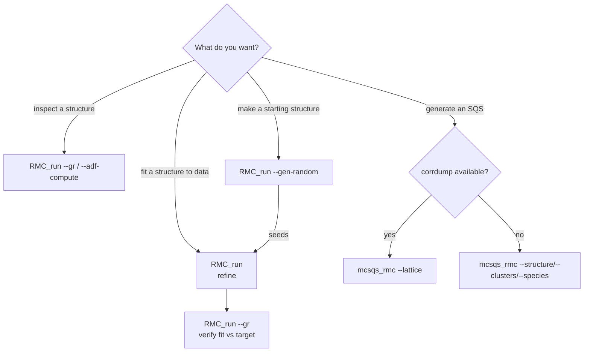
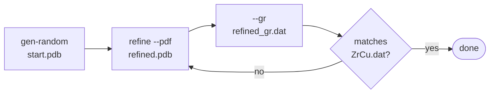

# Workflows

End-to-end example runs for the two executables, `RMC_run` (refinement +
analysis) and `mcsqs_rmc` (SQS search). For the full flag reference see
[README.md](README.md); for the architecture see [DESIGN.md](DESIGN.md).

All commands assume a release build in `build/` (`cmake -B build
-DCMAKE_BUILD_TYPE=Release && cmake --build build`).



The refine path is the core loop; analysis, generation and verification wrap
around it. The two SQS paths are mutually exclusive — pick one.

## 1. Refine a structure against a PDF

The default command. Perturb atoms until the computed g(r) matches experiment.

```bash
./build/RMC_run \
    --pdb   start.pdb            \
    --pdf   ZrCu.dat             \
    --rho0  0.0556               \
    --box   "30 30 30"           \
    --steps 200000               \
    --smart                      \
    --out   refined.pdb
```

- `--smart` turns on the adaptive selector (productive atoms get picked more).
- The output format follows the `--out` extension — swap to `refined.vasp` or
  `refined.lammps` to write VASP/LAMMPS instead.

Check progress quality by recomputing g(r) of the result and comparing to the
target (see §4).

## 2. Joint refinement against several datasets

Any combination of `--pdf` / `--sq` / `--adf` is refined together.

```bash
./build/RMC_run \
    --vasp  start.vasp           \
    --pdf   ZrCu.dat             \
    --adf   adf_target.dat       \
    --adf-cutoff 3.4             \
    --rho0  0.0556               \
    --steps 500000               \
    --out   refined.vasp
```

The cell comes from the VASP input, so `--box` is omitted.

## 3. Gradient-driven moves and a stochastic accept rule

Steer atoms along −∇χ² and accept with simulated annealing instead of the
default greedy quench.

```bash
./build/RMC_run \
    --lammps start.lammps --types "Zr Cu" \
    --pdf    ZrCu_glass.dat               \
    --rho0   0.0556                       \
    --move-gen langevin --step 0.05       \
    --steps  300000                       \
    --out    refined_centered.lammps
```

## 4. Analysis only (no Monte Carlo)

Compute g(r) of a structure and write the total + per-pair partials:

```bash
./build/RMC_run --pdb refined.pdb --box "30 30 30" --gr \
    --rmin 0 --rmax 10 --nbins 200 --gr-out refined_gr.dat
```

Compute the bond-angle distribution:

```bash
./build/RMC_run --pdb refined.pdb --adf-compute --adf-cutoff 3.4 \
    --adf-out adf.dat
```

## 5. Generate a starting structure

Make a random amorphous configuration to seed a refinement:

```bash
./build/RMC_run --gen-random --elements "Zr Cu" --counts "50 50" \
    --spacing 3.0 --out start.pdb
```

Then feed `start.pdb` into §1.

## 6. Ensemble (multi-start) refinement

Run several replicas in parallel and keep the lowest-χ² result. Each replica
uses `--seed + i`.

```bash
./build/RMC_run \
    --pdb     start.pdb     \
    --pdf     ZrCu.dat      \
    --rho0    0.0556        \
    --box     "30 30 30"    \
    --steps   200000        \
    --ensemble 4            \
    --seed    42            \
    --out     refined.pdb
```

## 7. SQS search via corrdump (`mcsqs_rmc`)

Generate a Special Quasirandom Structure from an ATAT `rndstr.in` primitive
lattice. `corrdump` enumerates the cluster orbits; the orbits are expanded over
the supercell and the engine swaps occupancies to match disordered targets.

```bash
mcsqs_rmc --lattice rndstr.in --supercell "2 2 2" \
          --d2 4.0 --d3 3.0                        \
          --replicas 8 --steps 500000              \
          --sampler anneal --T0 1.0 --cooling 0.9  \
          --out bestsqs.pdb
```

Writes `bestsqs.pdb` and an ATAT `bestsqs.out`, and prints the result's
correlations recomputed by `corrdump` as an independent cross-check.

## 8. SQS search without corrdump (legacy)

When `corrdump` is unavailable, supply a fixed-site structure, a pre-enumerated
cluster-orbit file, and a species map directly. No cross-check is emitted.

```bash
mcsqs_rmc --structure rndstr.pdb \
          --clusters  clusters.out \
          --species   "Cu:+1,Au:-1" \
          --replicas  8 --steps 500000 \
          --out bestsqs.pdb
```

`--lattice` and `--structure` are mutually exclusive — pick one pipeline.

## Typical end-to-end sequence



```bash
# 1. seed
./build/RMC_run --gen-random --elements "Zr Cu" --counts "100 100" \
    --spacing 3.0 --out start.pdb

# 2. refine against the measured PDF
./build/RMC_run --pdb start.pdb --pdf ZrCu.dat --rho0 0.0556 \
    --box "30 30 30" --steps 300000 --smart --out refined.pdb

# 3. verify: recompute g(r) of the refined structure
./build/RMC_run --pdb refined.pdb --box "30 30 30" --gr \
    --gr-out refined_gr.dat
```

Compare `refined_gr.dat` against `ZrCu.dat` to judge the fit.
